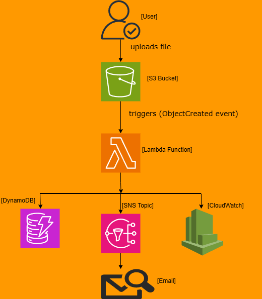
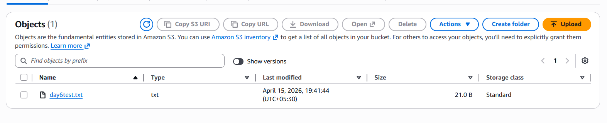
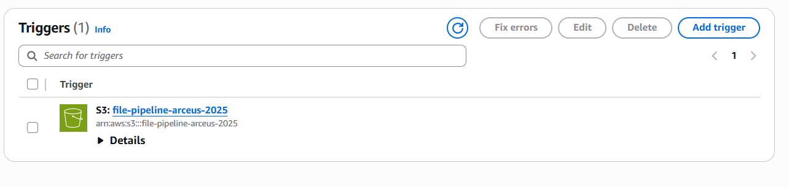
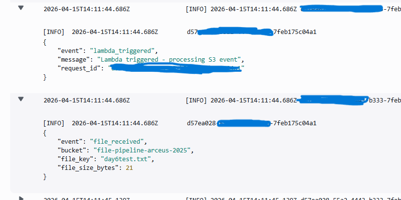
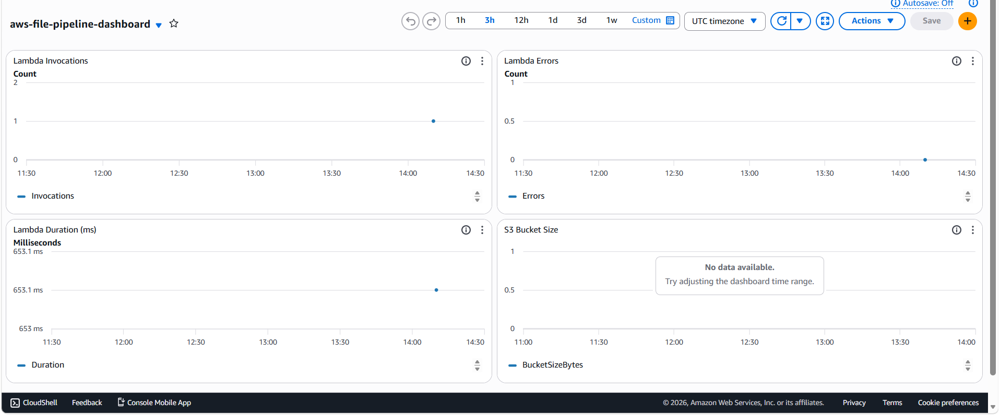
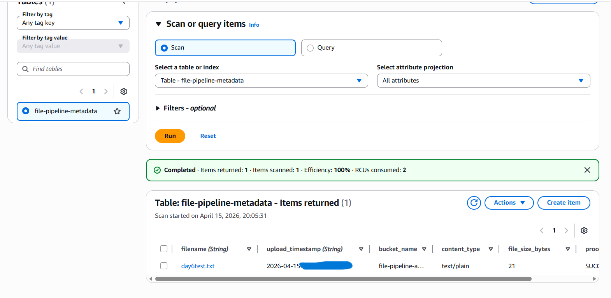
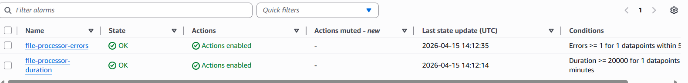
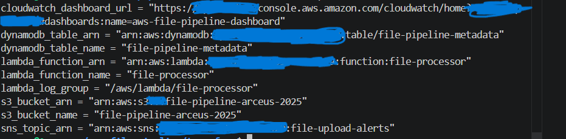

# AWS Serverless File Processing Pipeline

A production-grade serverless file processing pipeline built entirely on AWS using Infrastructure as Code (Terraform).

## Architecture



## How It Works

1. A file is uploaded to an **S3 bucket**
2. S3 triggers a **Lambda function** automatically via an ObjectCreated event
3. Lambda reads the file metadata (name, size, type, timestamp)
4. Lambda writes the metadata to **DynamoDB** for persistent storage
5. Lambda publishes a notification to **SNS** which sends an **email alert**
6. All logs are structured as JSON and sent to **CloudWatch**
7. CloudWatch **alarms** monitor for errors and duration breaches
8. A CloudWatch **dashboard** provides real-time pipeline visibility

## Services Used

| Service | Purpose |
|---|---|
| S3 | File storage, versioning, and event trigger |
| Lambda (Python 3.11) | Serverless file processing |
| DynamoDB | NoSQL metadata storage |
| SNS | Email notifications |
| CloudWatch | Structured logging, alarms, dashboard |
| IAM | Least-privilege permissions |
| Terraform | Full infrastructure as code |

## Project Structure

aws-file-pipeline/
├── terraform/
│   ├── main.tf          # Terraform and provider config
│   ├── variables.tf     # Input variables
│   ├── outputs.tf       # Output values
│   ├── s3.tf            # S3 bucket and versioning
│   ├── iam.tf           # IAM role and policy
│   ├── lambda.tf        # Lambda function and trigger
│   ├── dynamodb.tf      # DynamoDB table
│   ├── sns.tf           # SNS topic and subscription
│   ├── cloudwatch.tf    # Log group, alarms, dashboard
│   └── lambda_function.py  # Python Lambda code
└── screenshots/         # Live AWS resource screenshots

## How to Deploy

### Prerequisites
- AWS CLI configured (`aws configure`)
- Terraform installed
- AWS account with appropriate permissions

### Deploy

```bash
git clone https://github.com/YOUR_USERNAME/aws-file-pipeline.git
cd aws-file-pipeline/terraform
terraform init
terraform apply
```

### Test

```bash
echo "test file" > testfile.txt
aws s3 cp testfile.txt s3://file-pipeline-arceus-2025/
```

### View Outputs

```bash
terraform output
```

### Destroy

```bash
terraform destroy
```

## Screenshots

### S3 Bucket with Uploaded File


### Lambda Function with S3 Trigger


### CloudWatch Structured JSON Logs


### CloudWatch Monitoring Dashboard


### DynamoDB Metadata Record


### CloudWatch Alarms


### Terraform Output


## Key Concepts Demonstrated

- **Event-driven architecture** — Lambda only runs when triggered, zero idle cost
- **Infrastructure as Code** — entire stack deployable with one command
- **Least privilege IAM** — Lambda only has permissions it needs
- **Structured logging** — JSON logs queryable in CloudWatch Insights
- **Observability** — alarms, dashboard, and email alerts
- **Modular Terraform** — separate files per service, variables, outputs

## Author

**Pusalapati Durga Rao**
AWS Certified Solutions Architect Associate | AWS Cloud Practitioner
[LinkedIn](https://linkedin.com/in/www.linkedin.com/in/durgarao-p) | [GitHub](https://github.com/DurgaRaoP)
